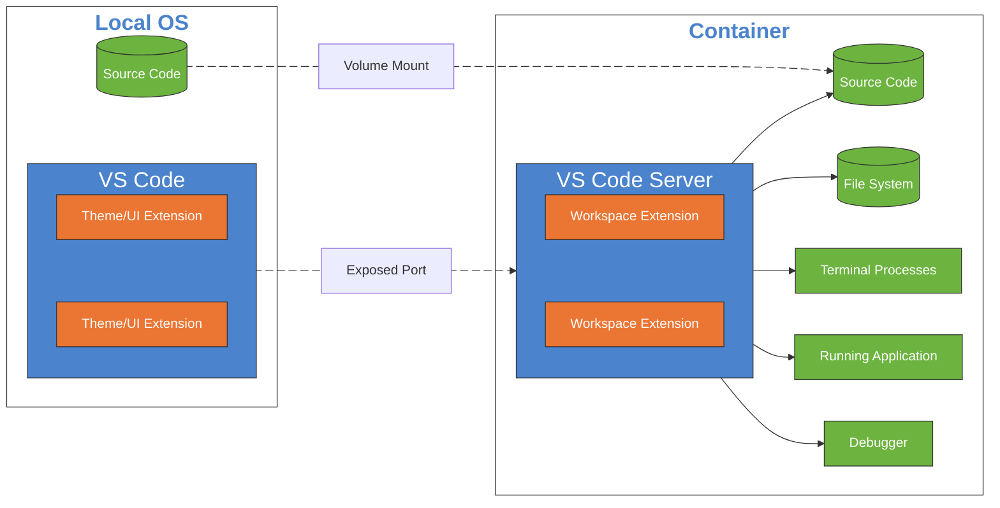

# Use the full potential of devcontainers

---
title: Speaker
layout: intro
src: special-slides/speaker.md
---

---
layout: image-right
background: /compass-right.png
title: Agenda
hideInToc: true
---

<h1 class="h-auto!"> Agenda </h1>

<div class="ml-16">

<Toc minDepth="1" maxDepth="1"/>

</div>

---
layout: two-column
---

# Why Dev-Containers?

::left::

<v-clicks>

- **Isolate dependencies** and avoid conflicts
- **Portability** across different systems
- Transforming how we write, **test**, and deploy code
- Applicable to web development, DevOps, and beyond (full-stack))
- Ensure **consistent** environments across teams
- Solve the **"it works on my machine"** issue
</v-clicks>


::right::
<v-click>

## Supported IDEs

- **Visual Studio Code**
- GitHub Codespaces
- Visual Studio (2022+)
- JetBrains IDEs (IntelliJ IDEA)
- CodeSandbox
- [more...](https://containers.dev/supporting)
</v-click>

<!-- Notes -->
<!-- 
- use/install mutible versions the same runtimes frameworks (e.g. nodejs, python, ruby, etc.)
- These IDEs provide built-in or plugin-based support for Dev-Containers, making it easier to integrate them into your workflow. 
-->

---
layout: two-column
hideInToc: true 
---
# Development Performance Considerations

::left::

## Pro

- Faster setup times
<v-clicks>

- Optimized **resource** usage compared to full Dev-VMs
- Faster **context** switching
- Improved developer **productivity**
- **Isolation** of environments

- Simplified **onboarding** for new team members
- Easier **collaboration** across distributed teams
- Enhanced **security** through isolation
</v-clicks>

::right::

<v-click>

## Contra

- Virtualization overhead slows down
</v-click>
<v-clicks>

- Container images can be large and consume **disk space**
- Isolation can lead to **access issues** (network, debugging)
- **Learning** curve for new tools and technologies

</v-clicks>

<!-- Notes -->
<!-- Using Dev-Containers can even lead to performance improvements, making your workflows more efficient. -->

---
layout: image-right
background: /devcontainer2.jpeg
hideInToc: true
---

# Prerequisites


<v-clicks>

- **Docker**: Docker is installed and **_running_** on your system
  - **Windows**: Docker Desktop 2.0+ on Windows 10 Pro/Enterprise. Windows 10 Home (2004+) requires Docker Desktop 2.3+ and the WSL 2 back-end. 
  _(Docker Toolbox is not supported. Windows container images are not supported.)_
  - **macOS**: Docker Desktop 2.0+.
  - **Linux**: Docker CE/EE 18.06+ and Docker Compose 1.21+. (The Ubuntu snap package is not supported.
- **Visual Studio Code**: Install VS-Code or any other supporting IDE
  - **Dev Containers Extension**: Add the "Dev Containers" extension in VS-Code
- **Access to Container Images**: Ensure access to required container registries (e.g., Docker Hub)

</v-clicks>


<!-- Notes -->
<!-- 
Docker Toolbox: is a legacy toolset provided by Docker for running Docker containers on older systems 
## Optional Tools / VS-Code Extensions
- **GitHub Codespaces**: For cloud-based development
- **Docker Compose**: For multi-container setups
- **Custom Scripts**: Automate environment setup
-->

---
layout: image-right
background: /devcontainer_move.jpeg
hideInToc: true
---

# Configuring

<br/>
<v-click>

  - Create a `.devcontainer` folder in your project
  - Add a `devcontainer.json` file with configuration details
  - Use predefined templates or customize as needed
</v-click>
<br/>
<v-click> 

- Open the project in the containerized environment
</v-click>

<!-- Notes -->

---
layout: image-left
background: /devcontainer_move.jpeg
---

# VS-Code assisted Devcontainer creation


## VS-Code assisted
<v-clicks>

- Use the Command Palette <kbd>Ctrl</kbd>+<kbd>Shift</kbd>+<kbd>P</kbd>  
  - Select "Dev Containers: Add Development Container Configuration Files"
- Choose a template or customize your own configuration etc. 
  - ...
</v-clicks>
<br/>
<v-click>

- VS-Code will generate the necessary files for you
</v-click>
<br/>
<v-click> 

- Open the project in the containerized environment
  - Use the Command Palette again and select "Dev Containers: Reopen in Container"
</v-click>

<!-- Notes -->

---
layout: image-right-dark
background: /code-right.png
hideInToc: true
---
# Demo

<BlobText width="450" height="300">
<h1> Create a new Dev-Container </h1>
</BlobText>


<!-- Notes -->
<!-- Let's dive into the practical benefits of using Dev-Containers in your projects. -->

---
title: What Happens?
---

<h1 class="h-auto!"> What Happens?</h1>




---

# Configuration Options

<v-clicks>

- **VS-Code Extensions**: Install VS-Code extensions that enhance your workflow.
- **VS-Code Settings**: Configure settings specific to the container environment.
- **Environment Variables**: Customize your development environment with specific variables.
- **Post-Create Commands**: Run scripts or commands after the container is created to set up your environment.
- **Volume Mounts**: Persist data by mounting host directories into the container.
- **Custom Dockerfile**: Use a custom Dockerfile for more control over the container image.
- **Remote User**: Specify the user that the container should run as.

</v-clicks>


---
layout: image-right
background: /bulb.jpeg
hideInToc: true
---

# Examples

<v-clicks>

- **Web Development**: Use Node.js, React, or Angular in isolated environments
- **Full-Stack**: development environments with frontend and backend services
- **Data Science**: Run Jupyter Notebooks with Python and R dependencies pre-installed
- **Embedded Systems**: Develop and test firmware in a containerized environment
- **Legacy Applications**: Maintain older software versions without affecting the host system

</v-clicks>

<!-- Notes -->
<!-- Dev-Containers are versatile and can be used across various domains, from web development to embedded systems. -->

---
hideInToc: true
---

# Typical Usage: Web Development

- Use a pre-configured Node.js container for consistent development
- Install project dependencies in the container
- Run and debug applications directly in the containerized environment
- Share the container configuration with the team for consistency

```json {*}{maxHeight:'250px'}
// filepath: .devcontainer/devcontainer.json
{
  "name": "Node.js Dev Container",
  "image": "mcr.microsoft.com/vscode/devcontainers/javascript-node:18",
  "postCreateCommand": "npm install",
  "customizations": {
    "vscode": {
      "extensions": [
        "dbaeumer.vscode-eslint",
        "esbenp.prettier-vscode"
      ]
    }
  },
  "remoteUser": "node"
}
```

<!-- Notes -->
<!-- Web developers can benefit from Dev-Containers by ensuring consistent environments and avoiding dependency conflicts. -->

---
src: special-slides/devcontainer/full-stack-devcontainer.md
---

<!-- 
full-stack-devcontainer-md 
including a DEMO
-->

---
title: "Example: Data Science Dev-Container"
hideInToc: true
---

<h1 class="h-auto!"> Example: Data Science Dev-Container </h1>

```json {*|13}{maxHeight:'250px'}
// filepath: .devcontainer/devcontainer.json
{
  "name": "Data Science Dev Container",
  "image": "mcr.microsoft.com/vscode/devcontainers/python:3.9",  
  "features": {
    "ghcr.io/devcontainers/features/docker-in-docker:2": {}
  },
  "postCreateCommand": "pip install -r requirements.txt",
  "settings": {
    "python.pythonPath": "/usr/local/bin/python"
  },  
  "remoteUser": "python"
}
```

<v-clicks>

- **Python**: Pre-installed Python 3.9 environment
- **Jupyter Notebooks**: Ready-to-use Jupyter Notebook support
- **Dependencies**: Install additional Python libraries via `requirements.txt`
- **Docker-in-Docker**: Run Docker commands within the container

</v-clicks>

<!-- Notes -->
<!-- 
This example demonstrates how to set up a Dev-Container for data science projects, including Python, Jupyter, and other dependencies. 
-->

---
hideInToc: true
---
# Available Features

<v-clicks>

- [Azure CLI	Dev Container](https://github.com/devcontainers/features/tree/main/src/azure-cli) ➡️	`ghcr.io/devcontainers/features/azure-cli:1`
- [Common Utilities](https://github.com/devcontainers/features/tree/main/src/common-utils) &nbsp;&nbsp;&nbsp;&nbsp;&nbsp;&nbsp;&nbsp;&nbsp;&nbsp;&nbsp;&nbsp;&nbsp;&nbsp; ➡️ `ghcr.io/devcontainers/features/common-utils:2` 
- [Docker (Docker-in-Docker)](https://github.com/devcontainers/features/tree/main/src/docker-in-docker) ➡️ `ghcr.io/devcontainers/features/docker-in-docker:2`
- [PowerShell](https://github.com/devcontainers/features/tree/main/src/powershell) ➡️ `ghcr.io/devcontainers/features/powershell:1`
- [k6](https://github.com/dhoeric/features/tree/main/src/k6) &nbsp;&nbsp;&nbsp;&nbsp;&nbsp;&nbsp;&nbsp;&nbsp;&nbsp;&nbsp;&nbsp; ➡️ `ghcr.io/dhoeric/features/k6:1`
- [Postman](https://github.com/frntn/devcontainers-features) ➡️ `ghcr.io/frntn/devcontainers-features/postman:1`

<br/>

- [more ... https://containers.dev/features](https://containers.dev/features)

</v-clicks>

<v-click>

```json
{
  "features": {
    "ghcr.io/devcontainers/features/docker-in-docker:2": {}
  },
}
```

</v-click>

<!-- Notes -->
<!-- 
small selection of https://containers.dev/features
-->

---
hideInToc: true
---

# Environment variables

**containerEnv**: apply to the entire containe

```json
"containerEnv": {
    "MY_CONTAINER_VAR": "some-value-here",
    "MY_CONTAINER_VAR2": "${localEnv:SOME_LOCAL_VAR}"
}
```

<br/>
<v-click>

**remoteEnv**: variables for VS Code and related sub-processes (terminals, tasks, debugging, etc.)

```json
"remoteEnv": {
    "PATH": "${containerEnv:PATH}:/some/other/path",
    "MY_REMOTE_VARIABLE": "some-other-value-here",
    "MY_REMOTE_VARIABLE2": "${localEnv:SOME_LOCAL_VAR}"
}
```
</v-click>

<!-- Notes -->
<!-- 
root level setting
-->

---
title: Docker
---

<h1 class="h-auto!"> Docker </h1>

## Dockerfile based

```json
{
  "build": {
    "context": ".",
    "dockerfile": "Dockerfile",
    "args": {
      "NODE_VERSION": "18",
      "PYTHON_VERSION": "3.9"
    },
    "target": "development",
    "cacheFrom": [
      "type=registry,ref=myregistry.com/myimage:cache"
    ]
  },
}
```

---
title: Docker Compose
---

<h1 class="h-auto!">  Docker Compose</h1>

```json{3-6|7|8|*}
{
  "name": "Full-Stack Dev Container",
  "dockerComposeFile": [
    "docker-compose.yml",
    "docker-compose.override.yml"
  ],
  "service": "app",
  "runServices": [ "app", "be-service", "db" ],
  "workspaceFolder": "/workspace",
}
```

<v-clicks at="1">

- `service` Specifies the main service to use as the development container
- `runServices` Lists the services that should be started when the container is launched
</v-clicks>
<br/>

 The `image` and `dockerfile properties` are not needed since Docker Compose supports them natively.
 

---
title: GitHub Codespaces
layout: image-right
background: /GitHub-Codespaces.svg
backgroundSize: 80%
---

<h1 class="h-auto!"> GitHub Codespaces </h1>


```json{2-5}
{   "name": "Container for Codespaces",    
    "hostRequirements": { // codespaces env
        "cpus": 8,
        "memory": "8gb",
        "storage": "32gb"
    },
    "image": "mcr.microsoft.com/vscode/...}
```
<br/>

<v-clicks>

- create a Codespace based on your `.devcontainer` definitions:
  - select: `Code` ➡️ `Codespaces` ➡️ `...` ➡️ `New with options` 
- VS Code can **attach to** a running [Codespace](https://github.com/harrybin/presentations/tree/main)
- VS Code can **controll** the Codespace environment (e.g. rebuild, restart, etc.)

</v-clicks>

<!-- Notes -->
<!--
Additional configuration options for GitHub Codespaces

DEMO:

- open: https://github.com/harrybin/presentations/tree/main
- select: `Code` ➡️ `Codespaces` ➡️ `...` ➡️ `New with options`
 
-->

---
title: Performance Tweeks
---

<h1 class="h-auto!"> Performance Tweeks </h1>

<v-clicks>

- Clone Repository in Container Volume
- Use a targeted named volume
  - folders like `node_modules`, data folders, or output folder  
  ```json
  "remoteUser": "node",
  "mounts": [
      "source=${localWorkspaceFolderBasename}-node_modules,target=${containerWorkspaceFolder}/node_modules,type=volume"
  ],
  "postCreateCommand": "sudo chown node node_modules"
  ```
- Use a named volume for your entire source tree
  ```json
  "workspaceMount": "source=your-volume-name-here,target=/workspace,type=volume"
  "workspaceFolder": "/workspace",
  ```

- Use WSL

</v-clicks>


---
layout: image-left
background: /wsl_pinguin.jpeg
---

# A Special Dev-Container

## WSL (Windows Subsystem for Linux)

<v-click>

- Windows 10 2004 and up (WSL 2)
- Docker Desktop 2.3+ includes WSL 2 Engine
- WSL 2 = full Linux kernel
  
</v-click>

<br/>

<v-click>

## Benefits
- better **performance**
- system integration 
    - Explorer
    - VS-Code (remote Explorer)
    - Windows Terminal
    - WSL commands
    - UI apps from Linux (e.g. Firefox, Chrome, etc.)

</v-click>

<!-- Notes -->

---
title: Windows Dev Drive
layout: image-right
background: /dev-drive.png
backgroundSize: 80%
hideInToc: true
---

<h1 class="h-auto!"> Windows Dev Drive </h1>

<v-clicks>

- Available in **Windows 11 22H2+** and Windows Server 2022+
  - create as a new **volume** or convert an existing NTFS volume
  - create as VHDX or **VHD** file
- **ReFS-based volume** optimized for developer workloads
- Uses **performance mode** by default:
  - Reduced security scanning by **Microsoft Defender**
  - **Optimized** file system oper**ations with ReFS
  - **Bypassed** file system **filters** that slow I/O
  - **Enhanced caching** for developer files
  - **Priority I/O** scheduling for file operations
- Designed for **source code, packages, and build outputs**

</v-clicks>


<!-- Notes -->
<!-- 
Dev Drive is Microsoft's answer to performance issues in Windows development environments. It provides native Windows performance improvements without needing WSL virtualization.

## Benefits vs WSL

- **30-50% faster** file I/O operations
- **Native Windows** performance without virtualization overhead
- **Better integration** with Windows tools and antivirus exclusions
- **Automatic trust** for developer tools and processes
- **Simplified setup** - no Linux subsystem required

[https://learn.microsoft.com/en-us/windows/dev-drive/](https://learn.microsoft.com/en-us/windows/dev-drive/)
-->


---
layout: image-left
background: /devcontainer2.jpeg
hideInToc: true
---

# Conclusion

<v-clicks>

- **IaC**: Define environments with `devcontainer.json` for consistency and version control.
- **Security**: Isolated environments reduce dependency conflicts and vulnerabilities.
- **Vs. Dockerfiles/Compose**: Simplified setup (e.g. include mountpoint definitions), and includes predefined features.
- **Remote Development**: Supports remote development with VS Code, no need to run Docker locally.
- **GitHub Codespaces**: Enables cloud-based, consistent environments directly from repositories.

</v-clicks>

<!-- Notes -->
<!-- 
By adopting Dev-Containers, you can transform your development process into something more efficient, secure, and enjoyable.
-->

---
src: /special-slides/questions.md
---

---
src: /special-slides/thank-you.md
---

---
layout: end
level: 2
hideInToc: true
---

  Juli 2025

<br/>

# End of presentation

---
layout: end
level: 2
hideInToc: true
---

  Mai 2025

<br/>

# End of presentation
